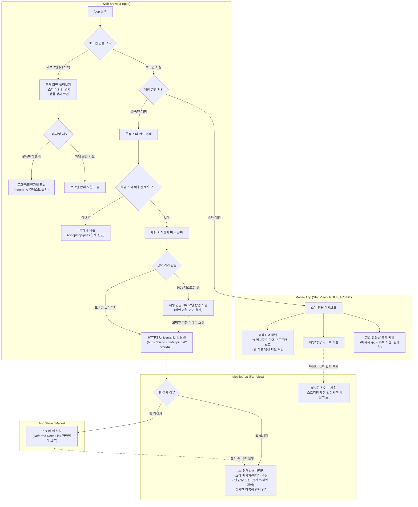

# DM 메뉴 1차 탐색

## 1. 시스템 구조 및 서비스 역할 분담

웹 브라우저(`/pop`)와 모바일 앱(Fan/Star App) 간의 명확한 역할 경계와 사용자 상태에 따른 진입 분기를 정의합니다.

### 1.1 시스템 흐름도 (Mermaid)

### 1.2 역할 분담 정의

1. **웹 브라우저 (`/pop`)의 역할**:
   - 아티스트 라인업 소개 및 스타별 DM 이용권 탐색 진입점 제공.
   - 게스트/미보유자 대상의 회원 인증 및 결제 유도 (`/shop/pop-pass`).
   - 이용권 보유자 대상의 디바이스별 안전한 앱 인계 (모바일: Universal Link 직접 호출 / PC: QR 모달 팝업 노출).
2. **모바일 앱 (Fan)의 역할**:
   - 스타의 1:N 브로드캐스트 메시지 수신 및 1:1 대화 형태 렌더링.
   - 팬의 답장 전송 및 글자 수/티켓 제약 로직 수행.
   - 실시간 다국어 번역 병기 및 라이브 스트리밍 시청/참여.
3. **모바일 앱 (Star)의 역할**:
   - 아티스트 인증 계정(`ROLE_ARTIST`) 전용 대시보드 및 공식 채널 관리.
   - 텍스트, 스티커, 사진, 음성 메시지의 팬덤 대상 브로드캐스팅.
   - 팬들이 보낸 답장 스트림의 안전한 모니터링 및 실시간 라이브 개설.
   - 월간 활동 지표(메시지 수, 라이브 시간, 출석 횟수) 조회.

---

## 2. 사용자 페르소나 및 상태 정의

| 사용자 역할               | 상태 정의                                   | UI 노출 상태 (`/pop`)                                                 | 주요 권한 및 행동 범위                                                                         |
| :------------------------ | :------------------------------------------ | :-------------------------------------------------------------------- | :--------------------------------------------------------------------------------------------- |
| **게스트 (Guest)**        | 로그인하지 않은 방문자                      | 스타별 카드에 **'구독하기'** 버튼 노출 (또는 '채팅 시작' 비활성 안내) | 라인업 및 상품 정보 탐색 가능. 구매 또는 채팅 진입 시도 시 로그인 모달 유도.                   |
| **팬 (이용권 미보유)**    | 로그인 완료 회원 (해당 스타 이용권 없음) | 스타별 카드에 **'구독하기'** 버튼 노출                                | `/shop/pop-pass`로 이동하여 1개월 정기결제 또는 12개월 기간형 이용권 주문/결제.                |
| **팬 (이용권 보유)**      | 특정 스타의 유효 DM 이용권을 보유한 회원    | 해당 스타 카드에 **'채팅 시작하기'** 버튼 동적 활성화                 | 접속 기기(모바일/PC)에 따라 딥링크 호출 또는 QR 모달 노출을 통해 모바일 앱 1:1 채팅방 입장.    |
| **스타 (Star)**           | 아티스트 권한 계정 (`ROLE_ARTIST`)          | 앱 전용 대시보드로 자동 연결                                          | 본인 채널 입장, 1:N 메시지/미디어 발송, 팬 답장 피드 열람, 라이브 개설, 월간 활동량 통계 열람. |
| **운영자/테스터 (Admin)** | 내부 검증 계정 (`allowStarBypass=true`)     | 디버깅 및 전체 채널 접근 가능                                         | 테스트베드 환경에서 이용권 결제 없이 전 스타 채널 열람 및 기능 검증.                           |

---

## 3. 사용자 스토리 및 수용 기준 (Acceptance Criteria)

### 3.1 팬 (Fan) — 웹 탐색 및 앱 인계 (Web to App)

#### [US-FAN-01] 이용권 보유 팬의 채팅방 진입 및 디바이스별 인계

> **As a** 특정 스타의 POP 이용권을 보유한 팬으로서,  
> **I want** `/pop` 페이지에서 해당 스타의 '채팅 시작하기'를 선택하여,  
> **So that** 접속 환경(모바일 브라우저/PC 웹)에 최적화된 방식으로 모바일 앱의 1:1 채팅방에 안전하게 진입하고 싶다.

- **수용 기준 (Acceptance Criteria)**:
  - **AC-FAN-01-01 (모바일 브라우저 진입 및 Deferred Deep Link)**:
    - **Given**: 팬이 모바일 웹 브라우저에서 `/pop`에 로그인되어 있고, 해당 스타(예: 신요성분신)의 유효 이용권을 보유하고 있다.
    - **When**: 해당 스타 카드의 [채팅 시작하기] 버튼을 탭한다.
    - **Then**:
      1. 앱이 설치되어 있는 경우, HTTPS Universal Link(`https://hiand.com/app/chat?starId={starId}`)를 통해 앱이 실행되며 해당 스타와의 1:1 채팅방으로 즉시 진입한다.
      2. 앱이 미설치된 경우, OS별 앱스토어(Google Play / App Store) 설치 페이지로 이동하며, 설치 후 최초 실행 시 원래 진입하려던 채팅방으로 자동 복원(Deferred Deep Link)된다.
  - **AC-FAN-01-02 (PC 데스크톱 웹 진입 및 QR 모달 팝업)**:
    - **Given**: 팬이 PC 데스크톱 웹 브라우저에서 `/pop`에 로그인되어 있고, 해당 스타 이용권을 보유하고 있다.
    - **When**: 해당 스타 카드의 [채팅 시작하기] 버튼을 클릭한다.
    - **Then**: 화면 전체가 전환되지 않고, 화면 중앙에 **'채팅 연결 QR 코드 모달 팝업'**이 노출된다. QR 코드에는 모바일 기본 카메라로 스캔 가능한 표준 HTTPS Universal Link가 인코딩되어 있으며, 모바일 스캔 시 AC-FAN-01-01의 앱 실행 흐름으로 이어진다.
  - **AC-FAN-01-03 (복수 이용권 보유 상태 노출)**:
    - **Given**: 팬이 2명 이상의 스타(예: 신요성분신, 김배우) 이용권을 보유하고 있다.
    - **When**: `/pop` 페이지에 진입한다.
    - **Then**: 보유한 스타들의 카드에는 [채팅 시작하기]가 활성화되고, 미보유 스타들의 카드에는 [구독하기]가 명확히 구분되어 표시된다.

---

#### [US-FAN-02] 이용권 미보유 사용자 및 게스트의 구매 흐름 유도

> **As a** 이용권이 없는 게스트 또는 일반 회원으로서,  
> **I want** 스타와 소통하기 위해 필요한 이용권 정보와 구매 경로를 직관적으로 안내받아,  
> **So that** 로그인/인증을 완료하고 원하는 스타의 DM 이용권을 구매할 수 있다.

- **수용 기준 (Acceptance Criteria)**:
  - **AC-FAN-02-01 (게스트의 구매/채팅 시도 시 인증 및 컨텍스트 유지)**:
    - **Given**: 로그인하지 않은 게스트가 `/pop`에서 특정 스타의 [구독하기] 또는 비활성화된 진입점을 클릭한다.
    - **When**: 버튼을 누른다.
    - **Then**: 로그인/회원가입 모달이 노출되며, 로그인 또는 신규 회원가입이 완료되면 `return_to` 파라미터를 통해 직전에 선택했던 스타의 상품 결제 화면(`/shop/pop-pass`)으로 자동 복원된다.
  - **AC-FAN-02-02 (로그인 회원의 이용권 상품 탐색 및 결제 진입)**:
    - **Given**: 로그인 회원이 특정 스타의 이용권을 보유하지 않은 상태이다.
    - **When**: 스타 카드의 [구독하기] 버튼을 클릭한다.
    - **Then**: 해당 스타로 자동 필터링된 `/shop/pop-pass` 상품 상세로 이동하여 기간형/구독형 옵션을 확인하고 주문서 작성을 시작할 수 있다.

---

### 3.2 팬 (Fan) — 모바일 앱 1:1 DM 및 소통

#### [US-FAN-03] 1:1 DM 메시지/미디어 수신 및 단독 채팅방 경험

> **As a** 이용권을 보유하고 앱 채팅방에 입장한 팬으로서,  
> **I want** 스타가 보낸 메시지와 미디어를 나만을 위한 1:1 대화 형식으로 확인하여,  
> **So that** 스타와 친밀하게 소통하는 유대감을 느끼고 싶다.

- **수용 기준 (Acceptance Criteria)**:
  - **AC-FAN-03-01 (스타 발신 메시지 및 미디어 렌더링)**:
    - **Given**: 팬이 스타의 DM 채팅방에 입장해 있다.
    - **When**: 스타가 메시지를 발신한다.
    - **Then**: 스타가 보낸 텍스트, 이모티콘/스티커, 미디어(사진, 음성 메시지)가 스타와 팬의 단독 1:1 대화방 형식으로 렌더링된다.
  - **AC-FAN-03-02 (타 팬 답장 차단 및 1:1 뷰 보장)**:
    - **Given**: 수많은 팬이 동일한 스타에게 답장을 전송하고 있다.
    - **When**: 채팅방 화면을 확인한다.
    - **Then**: 다른 팬들이 작성한 답장이나 닉네임은 일체 노출되지 않으며, 스타의 메시지와 '본인이 작성한 답장'만 대화 타임라인에 표시된다.

---

#### [US-FAN-04] 팬의 답장 작성 및 메시지 제약 규칙

> **As a** 스타의 메시지를 수신한 팬으로서,  
> **I want** 정해진 정책(글자 수 및 답장 횟수) 내에서 스타에게 직접 답장을 작성하여 전송하여,  
> **So that** 스타에게 내 마음과 피드백을 안전하게 전달하고 싶다.

- **수용 기준 (Acceptance Criteria)**:
  - **AC-FAN-04-01 (답장 글자 수 제한 표시 및 검증)**:
    - **Given**: 팬이 메시지 입력창에 포커스한다.
    - **When**: 답장 텍스트를 입력한다.
    - **Then**: 기본 허용 글자 수(예: 기본 300자, 구독 유지 일수 구간별 가산 정책 적용)와 현재 입력 글자 수가 실시간(`N / Max`)으로 카운팅되며, 최대 글자 수 초과 입력이 차단된다.
  - **AC-FAN-04-02 (답장 티켓/빈도 제어)**:
    - **Given**: 스타가 1건 이상의 메시지를 발신한 상태이다.
    - **When**: 팬이 스타 메시지 1건에 대해 허용된 최대 답장 횟수(예: 3회)를 모두 발송 완료한다.
    - **Then**: 입력창이 비활성화되며 '스타의 다음 메시지를 기다려주세요' 안내가 노출된다. 스타가 새로운 메시지를 발송하면 답장 횟수가 다시 충전된다.

---

#### [US-FAN-05] 다국어 실시간 번역 설정 토글

> **As a** 글로벌 팬 또는 외국어 메시지를 수신한 팬으로서,  
> **I want** 채팅방 내 번역 토글 버튼을 활성화하여,  
> **So that** 스타의 원문 메시지와 번역문을 함께 확인하며 대화를 이해하고 싶다.

- **수용 기준 (Acceptance Criteria)**:
  - **AC-FAN-05-01 (원문 하단 번역문 병기 렌더링)**:
    - **Given**: 팬의 기기/앱 언어가 메시지 발신 언어와 다르다.
    - **When**: 채팅방 상단의 '실시간 번역' 토글을 ON으로 전환한다.
    - **Then**: 스타가 작성한 각 원문 메시지 말풍선 하단에 사용자의 설정 언어로 번역된 텍스트가 병기(Bilingual Display)되어 렌더링된다.
  - **AC-FAN-05-02 (번역 토글 비활성화)**:
    - **Given**: 번역 토글이 ON인 상태이다.
    - **When**: 번역 토글을 OFF로 전환한다.
    - **Then**: 번역문 레이아웃이 숨김 처리되고 원문 메시지만 깔끔하게 표시된다.

---

#### [US-FAN-06] 스타 라이브 방송 시청 및 실시간 참여

> **As a** 이용권을 보유한 팬으로서,  
> **I want** 스타가 시작한 실시간 라이브 방송 알림을 받고 입장하여,  
> **So that** 스타의 라이브를 시청하고 실시간 채팅과 하트를 보내며 교류하고 싶다.

- **수용 기준 (Acceptance Criteria)**:
  - **AC-FAN-06-01 (라이브 시작 푸시 및 즉시 입장)**:
    - **Given**: 스타가 라이브(채팅 또는 영상)를 개설했다.
    - **When**: 팬이 수신된 라이브 시작 푸시 알림을 탭하거나 DM 방 상단의 [라이브 참여하기] 배너를 누른다.
    - **Then**: 실시간 스트리밍 룸으로 즉시 연결되어 지연 없이 라이브 화면에 입장한다.
  - **AC-FAN-06-02 (실시간 채팅 및 인터랙션 반응)**:
    - **Given**: 팬이 라이브 룸에 접속 중이다.
    - **When**: 실시간 댓글을 작성하거나 하트/응원 반응 버튼을 탭한다.
    - **Then**: 스타와 다른 시청 팬들의 화면에 실시간으로 댓글 및 반응 애니메이션이 렌더링된다.
  - **AC-FAN-06-03 (라이브 종료 처리)**:
    - **Given**: 스타가 방송을 종료했다.
    - **When**: 세션이 마감된다.
    - **Then**: '방송이 종료되었습니다' 안내 팝업이 노출되며, 확인 시 기존 1:1 DM 대화방으로 복귀한다.

---

### 3.3 스타 (Star) — 아티스트 전용 기능 및 대시보드

#### [US-STAR-01] 스타 공식 채널 메시지/미디어 발송 및 팬 답장 모니터링

> **As a** HI& 공식 입점 스타로서,  
> **I want** 전용 채널에서 텍스트, 사진, 음성 메시지를 발송하고 팬들의 반응을 안전하게 모니터링하여,  
> **So that** 팬들에게 일상을 공유하고 지속 가능한 소통을 이어갈 수 있다.

- **수용 기준 (Acceptance Criteria)**:
  - **AC-STAR-01-01 (스타 권한 진입)**:
    - **Given**: 아티스트 권한 계정(`ROLE_ARTIST`)으로 로그인되어 있다.
    - **When**: 앱에 접속한다.
    - **Then**: 일반 팬용 홈이 아닌 스타 전용 대시보드 및 본인 공식 DM 채널이 첫 화면으로 활성화된다.
  - **AC-STAR-01-02 (다양한 미디어 브로드캐스팅)**:
    - **Given**: 스타가 채널 입력창을 연다.
    - **When**: 텍스트, 스티커, 사진, 음성 녹음 메시지를 작성/첨부하여 전송한다.
    - **Then**: 해당 스타 이용권을 보유한 모든 팬들의 1:1 채팅방으로 메시지가 1:N 브로드캐스팅된다.
  - **AC-STAR-01-03 (팬 답장 스트림 뷰어)**:
    - **Given**: 팬들이 스타 메시지에 대한 답장을 전송했다.
    - **When**: 스타가 채널 내 '팬 답장 모아보기' 탭을 확인한다.
    - **Then**: 팬들의 답장이 타임라인 피드 스트림 형태로 렌더링되며, 스타의 인지 부하를 줄이기 위한 악성 표현 필터링 및 키워드 모아보기 기능이 제공된다.

---

#### [US-STAR-02] 이번 달 활동량 및 사용량 통계 조회

> **As a** 활동 현황을 관리하고 정산/계약 기준을 점검하려는 스타로서,  
> **I want** 이번 달의 활동량 지표(메시지 수, 라이브 시간, 출석일)를 대시보드에서 조회하여,  
> **So that** 팬 소통량 추이를 투명하게 파악하고 활동 루틴을 관리할 수 있다.

- **수용 기준 (Acceptance Criteria)**:
  - **AC-STAR-02-01 (월간 3대 지표 정의 및 표시)**:
    - **Given**: 스타가 활동 통계 화면에 진입한다.
    - **When**: 이번 달(당월 1일 00:00:00 KST ~ 현재) 기준 통계를 조회한다.
    - **Then**: 다음 3가지 핵심 지표가 명확한 수치로 제공된다:
      1. **보낸 메시지 개수 (총 N건)**: 스타가 팬에게 발송 완료한 텍스트/미디어 총합.
      2. **라이브 진행 시간 (총 N시간 M분)**: 종료된 세션의 실제 방송 시간 합산.
      3. **활동 출석일 (총 N일)**: 당월 중 메시지 발송 또는 라이브 진행이 1건 이상 발생한 일자 수.

---

#### [US-STAR-03] 타 스타 채널 열람 정책 및 권한 제어

> **As a** 플랫폼 보안 및 아티스트 프라이버시를 보호해야 하는 플랫폼으로서,  
> **I want** 아티스트 계정이라 하더라도 타 스타의 유료 채널 접근을 엄격히 제한하여,  
> **So that** 아티스트 간 사적 대화 유출 위험을 방지하고 상호 프라이버시를 보장하고 싶다.

- **수용 기준 (Acceptance Criteria)**:
  - **AC-STAR-03-01 (타 스타방 기본 열람 차단)**:
    - **Given**: 스타 계정 A로 로그인되어 있다.
    - **When**: 다른 소속사 스타 B의 DM 채널을 선택한다.
    - **Then**: 타 스타방 접근 권한이 없으며, 임의로 열람하거나 메시지를 작성할 수 없다. (테스트/어드민 환경의 `allowStarBypass=true` 플래그 보유 계정만 예외적으로 열람 허용).
  - **AC-STAR-03-02 (사전 승인된 컬래버레이션 채널 예외)**:
    - **Given**: 스타 A와 스타 B 간 공식 컬래버레이션/게스트 이벤트가 설정되어 있다.
    - **When**: 지정된 기간 중 상대 채널에 입장한다.
    - **Then**: 승인된 게스트 권한으로 입장하여 공용 메시지를 남길 수 있다.

---

#### [US-STAR-04] 실시간 채팅 라이브 및 영상 라이브 개설

> **As a** 팬들과 실시간으로 소통하려는 스타로서,  
> **I want** 모바일 앱에서 원하는 형태(채팅 라이브 또는 영상 라이브)를 선택하여 방송을 개설하여,  
> **So that** 구독 팬들과 실시간으로 호흡하고 소통할 수 있다.

- **수용 기준 (Acceptance Criteria)**:
  - **AC-STAR-04-01 (라이브 모드 선택 및 세션 시작)**:
    - **Given**: 스타가 라이브 개설 메뉴를 선택한다.
    - **When**: '채팅 라이브' 또는 '영상 라이브' 모드를 선택하고 방송을 시작한다.
    - **Then**: 실시간 스트리밍 룸이 개설되고, 구독 팬들에게 즉시 시작 알림 푸시가 발송된다.
  - **AC-STAR-04-02 (세션 종료 및 통계 즉시 반영)**:
    - **Given**: 스타가 라이브 방송을 종료한다.
    - **When**: 세션 종료 버튼을 확인한다.
    - **Then**: 방송 세션이 안전하게 마감되며, 해당 진행 시간이 즉시 US-STAR-02의 '라이브 진행 시간' 캐시를 갱신(Cache Eviction/Write-Through)하여 대시보드에 즉시 반영된다.

---

## 4. PoC 웹 실측 사실과 To-Be 구현 방안 연계

| 구분                 | PoC 웹 실측 확인 사실 (As-Is)                                                | To-Be 시스템 구현 및 연계 방안                                                                                                                                                                                                          |
| :------------------- | :--------------------------------------------------------------------------- | :-------------------------------------------------------------------------------------------------------------------------------------------------------------------------------------------------------------------------------------- |
| **진입점 인터랙션**  | `/pop`의 배너 및 스타 5명 버튼이 모두 `/shop/pop-pass` 상품 목록으로 연결됨. | **이용권 보유 팬**: 버튼 텍스트가 **'채팅 시작하기'**로 동적 전환. - 모바일 접속: HTTPS Universal Link 호출. - PC 웹 접속: 화면 중앙에 QR 코드 모달 팝업 노출. **미보유자/게스트**: '구독하기' 버튼을 유지하여 상품 구매 유도. |
| **PC 인계 방식**     | 앱 설치 링크(D1-017) 클릭 시 새 탭 `/app` 정적 QR 페이지로 단순 이동함.      | `/app` 전체 페이지 이동 대신, `/pop` 화면 내 **'동적 QR 모달 팝업'**을 띄워 브라우징 컨텍스트 유지. QR에는 특정 스타 식별자(`starId`)가 포함된 유니버설 링크를 인코딩.                                                                  |
| **게스트 링크 예외** | 게스트 상태에서 앱 설치 링크(D1-017) 클릭 시 화면 이동 없음 (이슈 식별).     | 게스트라도 앱 설치 안내는 접근 가능해야 하므로 링크 타깃을 수정하거나, 비로그인 시에도 앱스토어 안내 모달이 뜨도록 예외 처리.                                                                                                           |
| **멤버십 vs DM**     | 우도환 멤버십 골드 보유자라도 My에서 DM 이용권 수량 0 확인.                  | 팬클럽 멤버십 권한과 DM 구독 이용권 엔터티를 엄격히 분리하여 권한 검증 엔진 설계.                                                                                                                                                       |

---

## 5. 핸드오프 기술 고려사항 및 QA 검증 체크리스트

### 5.1 기술 고려사항 (개발팀 참고)

1. **딥링크 규격 및 QR 코드 표준화**:
   - 커스텀 스키마(`hiand://`)를 QR 코드에 직접 탑재하면 모바일 기본 카메라에서 인식하지 못하므로, **표준 HTTPS Universal Link / App Link (`https://hiand.com/app/chat?starId={starId}&ref=web_qr`)**로 단일화.
   - 모바일 웹 브라우저 및 카메라 스캔 시 동일한 웹 브릿지 엔드포인트에서 앱 설치 여부를 판별하여 분기 처리.
2. **디퍼드 딥링크 (Deferred Deep Link) 파이프라인**:
   - 앱 미설치 사용자가 스토어 설치 후 첫 앱 오픈 시 전달된 `starId` 파라미터를 읽어 해당 스타 채팅방으로 즉시 온보딩할 수 있도록 어트리뷰션 툴(Branch/AppsFlyer 등) 또는 클립보드 복원 로직 연계.
3. **통계 데이터 일관성 및 캐싱 전략**:
   - 활동 통계(메시지 수, 라이브 시간, 출석일)는 고부하 쿼리이므로 Redis 캐시 레이어를 적용하되, **라이브 종료 세션 마감 및 메시지 발신 성공 시 해당 스타의 통계 캐시 키를 무효화(Cache Invalidation)**하여 실시간 일관성 보장.
   - 시간대 기준은 글로벌 확장을 고려하여 서버 저장은 UTC, 화면 표시는 아티스트 활동 기준 KST(`Asia/Seoul`)로 통일.
4. **인앱결제(IAP) 및 크로스 플랫폼 정책**:
   - 웹(`/shop/pop-pass`) 결제와 모바일 앱 스토어(Apple/Google) IAP 결제 간 구독 권한 데이터베이스를 동기화.
   - Apple App Store 가이드라인(Guideline 3.1.1) 준수를 위해 앱 내에서도 이용권 구독 상품 구매 UI 제공 대비.

---

### 5.2 QA 검증 체크리스트

- [ ] **게스트 분기**: 비로그인 상태에서 스타 카드 클릭 시 로그인 모달이 뜨고, 로그인 완료 후 원래 선택했던 상품 페이지로 이동하는가?
- [ ] **모바일 딥링크**: 모바일 브라우저에서 '채팅 시작하기' 클릭 시 앱이 즉시 실행되어 해당 스타 채팅방으로 열리는가?
- [ ] **디퍼드 딥링크**: 앱 미설치 상태에서 스토어로 이동하여 앱을 설치했을 때, 최초 실행 시 해당 스타 채팅방으로 자동 복원되는가?
- [ ] **PC 웹 QR 모달**: 데스크톱 웹에서 '채팅 시작하기' 클릭 시 페이지 이동 없이 QR 모달이 뜨며, 스마트폰 기본 카메라로 스캔 시 즉시 앱이 열리는가?
- [ ] **복수 이용권 상태**: 스타 A는 보유, 스타 B는 미보유인 계정에서 카드별 버튼('채팅 시작하기' vs '구독하기')이 정확히 분기 노출되는가?
- [ ] **1:1 뷰어 격리**: 다른 팬들이 답장을 보내더라도 내 채팅방 화면에는 오직 스타 메시지와 본인의 답장만 표시되는가?
- [ ] **팬 답장 제약**: 허용 글자 수 초과 입력이 제한되며, 최대 답장 횟수(예: 3회) 소진 시 입력창이 비활성화되는가?
- [ ] **번역 토글 병기**: 실시간 번역 ON 시 원문 하단에 번역문이 정상 병기되고, OFF 시 깔끔하게 사라지는가?
- [ ] **라이브 알림 및 시청**: 스타가 라이브 개설 시 팬에게 푸시가 오고, 탭 시 실시간 스트리밍 룸으로 즉시 입장 가능한가?
- [ ] **스타 통계 일치**: 스타가 메시지 발송 및 라이브 종료 시 대시보드 통계(메시지 건수, 누적 시간, 출석일)가 즉각 합산 반영되는가?
- [ ] **타 스타 채널 보안**: 스타 계정으로 타 스타 DM 채널에 임의 접근 시 열람이 차단되는가?

---

## 의견

- `테스트가 편한 환경`을 구성하는 것이 중요합니다.
  - 하이브리드앱 환경에서 계정, 이용권, 권한(주체) 등 복합적인 요소가 개입하기 때문에 원하는 상태의 화면으로 진입할 수 없다면, 개발/운영 이슈의 빠른 해결에 방해가 됩니다.
  - 테스트 계정에서 초기화를 위해 이용권 철회가 가능한지 살펴봤지만 아직 기능을 발견하지 못했습니다. 대안으로 탈퇴 후 재가입 제약이 자유로운지 확인 예정입니다.
- `상품 체계 파악`이 필요합니다.
  - 샵에서 확인할 수 있는 용어가 어떤 의미인지 아직 알 수 없습니다.
    - POP 전용, 기간형, 구독형, 현장수령, 온라인
