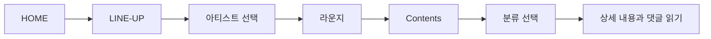
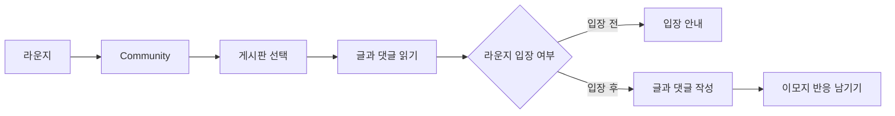
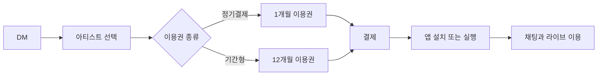
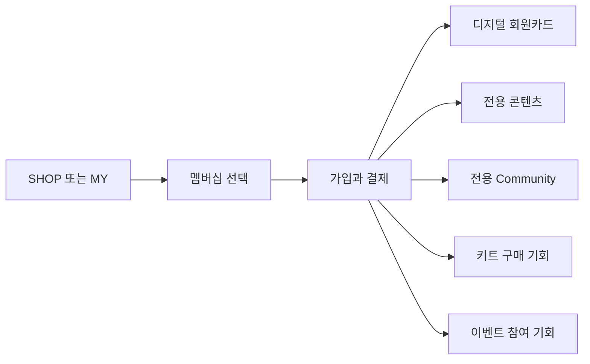
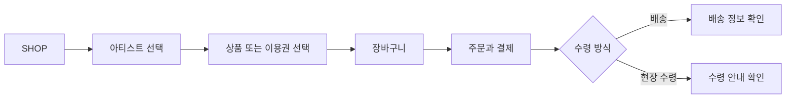

# HI& 주요 기능 지도

2026.09.14 기준으로 HI&의 주요 기능을 정리했다.

화면 구조와 사용자 행동을 두 가지 방식으로 정리했다.

- 사이트맵: 사용자가 이동할 수 있는 화면 구조
- 기능 지도: 화면에서 할 수 있는 행동과 조건

## 조사 범위

- HI& 공개 웹 화면
- HI& 로그인 뒤 웹 화면
- 박서준 라운지 비로그인 탐색 기록
- HI& 공식 FAQ와 공개 콘텐츠

PC Chrome에서 공개 화면과 로그인 화면을 확인했다.
결제, 라운지 입장, 글 작성은 실행하지 않았다.
개인정보와 계정별 이용 내역은 기록하지 않았다.

## 한눈에 보는 기능 지도

```mermaid
flowchart TD
    ROOT["HI&amp;"]

    ROOT --> HOME[HOME]
    ROOT --> LINEUP[LINE-UP]
    ROOT --> DM[DM]
    ROOT --> SHOP[SHOP]
    ROOT --> UTILITY[공통 메뉴]
    ROOT --> CS[고객지원]

    HOME --> DISCOVER[추천 콘텐츠 보기]
    HOME --> MY_LOUNGE[내 라운지 보기와 추가]
    HOME --> WEEKLY[주간 Community 글 보기]
    HOME --> HOME_SHOP[SHOP 상품 보기]

    LINEUP --> ARTIST_LIST[아티스트 목록 보기]
    ARTIST_LIST --> LOUNGE[아티스트 라운지 방문]

    LOUNGE --> JOIN[라운지 입장하기]
    LOUNGE --> CONTENTS[Contents]
    LOUNGE --> COMMUNITY[Community]
    LOUNGE --> STORY[Story]
    LOUNGE --> LOUNGE_NOTICE[라운지별 알림 설정]

    CONTENTS --> PORTFOLIO[PORTFOLIO]
    CONTENTS --> EVENT[EVENT]
    CONTENTS --> HILIGHT[HI-LIGHT]
    CONTENTS --> VIDEO[VIDEO]

    COMMUNITY --> BOARD[게시판 목록]
    BOARD --> POST_READ[글과 댓글 읽기]
    BOARD --> POST_WRITE[글과 댓글 쓰기]
    BOARD --> REACTION[이모지 반응 남기기]

    DM --> DM_ARTIST[아티스트 선택]
    DM_ARTIST --> BUY_PASS[DM 이용권 구매]
    BUY_PASS --> MONTHLY[1개월 정기결제]
    BUY_PASS --> FIXED[12개월 기간형]
    MONTHLY --> APP[앱 설치]
    FIXED --> APP
    APP --> CHAT[채팅과 라이브 이용]

    SHOP --> ARTIST_FILTER[아티스트별 상품 찾기]
    ARTIST_FILTER --> PRODUCT[상품과 이용권 선택]
    PRODUCT --> MEMBERSHIP[멤버십]
    PRODUCT --> MEMBERSHIP_KIT[멤버십 키트]
    PRODUCT --> DM_PASS[DM 이용권]
    PRODUCT --> CART[장바구니]
    CART --> ORDER[주문과 결제]
    ORDER --> DELIVERY[배송]
    ORDER --> PICKUP[현장 수령]

    UTILITY --> NOTIFICATION[알림]
    UTILITY --> CART_MENU[장바구니]
    UTILITY --> MY[MY]
    MY --> LOGIN[로그인]
    MY --> PROFILE[닉네임과 프로필 이미지]
    MY --> VOUCHER[이용권과 티켓]
    MY --> POINT[Point]
    MY --> SUBSCRIPTION[주문과 결제 내역]
    MY --> MY_POST[내 포스트와 댓글]
    MY --> REWARD[내 리워드]
    MY --> LANGUAGE[언어 설정]
    MY --> CURRENCY[통화 설정]
    MY --> NOTICE_SETTING[알림 설정]

    CS --> FAQ[FAQ 검색과 분류]
    FAQ --> FAQ_ACCOUNT[계정]
    FAQ --> FAQ_PAYMENT[결제와 주문]
    FAQ --> FAQ_LOUNGE[라운지]
    FAQ --> FAQ_DM[DM]
    FAQ --> FAQ_EVENT[이벤트와 보상]
```



## 사이트맵

```text
HI&
├─ HOME
│  ├─ 추천 콘텐츠
│  ├─ 내 라운지 보기와 추가
│  ├─ 주간 Community 글
│  └─ SHOP 상품
├─ LINE-UP
│  └─ 아티스트 라운지
│     ├─ 입장하기
│     ├─ Contents
│     │  ├─ PORTFOLIO
│     │  ├─ EVENT
│     │  ├─ HI-LIGHT
│     │  └─ VIDEO
│     ├─ Community
│     │  ├─ 아티스트별 게시판
│     │  ├─ 글 상세
│     │  ├─ 댓글
│     │  └─ 이모지 반응
│     ├─ Story
│     └─ 라운지별 알림
├─ DM
│  ├─ 아티스트 선택
│  ├─ 1개월 정기결제 이용권
│  ├─ 12개월 기간형 이용권
│  └─ 앱에서 채팅과 라이브 이용
├─ SHOP
│  ├─ 아티스트별 상품
│  ├─ 멤버십
│  ├─ 멤버십 키트
│  ├─ DM 이용권
│  ├─ 장바구니
│  ├─ 주문과 결제
│  ├─ 배송
│  └─ 현장 수령
├─ 공통 메뉴
│  ├─ 알림
│  ├─ 장바구니
│  └─ MY
│     ├─ 로그인
│     ├─ 프로필
│     ├─ 이용권과 티켓
│     ├─ Point
│     ├─ 멤버십
│     ├─ 주문과 결제 내역
│     ├─ 내 포스트·댓글·답글
│     ├─ 내 리워드
│     ├─ 언어와 통화
│     └─ 알림 설정
└─ 고객지원
   └─ FAQ
```

## 공개 메뉴와 내부 기능

| 구분 | 항목 | 공개 상태 |
| --- | --- | --- |
| 상단 주요 메뉴 | HOME, LINE-UP, DM, SHOP | 메뉴에 표시 |
| 상단 공통 메뉴 | 알림, 장바구니, MY | 메뉴에 표시 |
| 라운지 안 기능 | Story, Contents, Community | 라운지 안에서 표시 |
| SHOP과 MY에서 진입 | 멤버십, Point, 이용권, 티켓 | 상단 주요 메뉴에는 없음 |
| 상단 메뉴에서 확인 안 됨 | 라이브, 그룹 DM, 일정, 함께 듣기 | 독립 메뉴로 확인하지 못함 |

웹 DM 화면은 채팅과 라이브를 앱 기능으로 안내한다.
따라서 웹 메뉴 유무와 서비스 제공 여부는 다르다.

## 기능별 정리

| 영역 | 사용자가 하는 일 | 확인한 동작 | 이용 조건 |
| --- | --- | --- | --- |
| HOME | 내 라운지와 추천 항목 보기 | 콘텐츠, SHOP 상품, 주간 Community 글을 모아 보여준다. | 내 라운지는 로그인 필요 |
| LINE-UP | 아티스트 찾기 | 아티스트를 고르면 라운지가 열린다. | 비로그인 가능 |
| 라운지 | 아티스트 전용 공간 방문 | 라운지 화면을 먼저 볼 수 있다. `입장하기`는 별도 행동이다. | 열람은 비로그인 가능 |
| Contents | 공식 콘텐츠 보기 | EVENT, HI-LIGHT, VIDEO 등을 제공한다. 분류는 라운지마다 다르다. | 확인한 콘텐츠는 비로그인 가능 |
| Community | 게시판과 글 보기 | 게시판, 글, 댓글을 차례로 볼 수 있다. | 확인한 글은 비로그인 가능 |
| Community | 글, 댓글, 이모지 반응 남기기 | 입장 전 글쓰기를 누르면 라운지 입장을 안내한다. | 로그인과 라운지 입장 필요 |
| Community | 비공개 게시판 이용하기 | 다른 팬에게 보이지 않는 포스트를 제공한다. | 게시판별 조건 추가 확인 |
| Community | 태그로 글 찾기 | 게시글 태그를 누르면 같은 태그의 글을 연다. | 비로그인 열람 확인 |
| Story | 아티스트와 운영자의 글 보기 | 글, 이미지, 영상, 댓글, 반응 수를 보여준다. | 비로그인 열람 확인 |
| DM | 구독할 아티스트 찾기 | 아티스트 목록에서 구독 화면으로 이동한다. | 로그인 확인 |
| DM 이용권 | 이용 기간 고르기 | 1개월 정기결제와 12개월 기간형을 제공한다. | 로그인과 결제 필요 |
| DM 채팅 | 채팅과 라이브 이용하기 | 웹은 앱 설치를 안내한다. | 앱과 DM 이용권 필요 |
| SHOP | 아티스트별 상품 찾기 | 멤버십, 키트, DM 이용권 등을 보여준다. | 열람 가능, 구매는 로그인 필요 |
| 멤버십 | 전용 혜택 이용하기 | 회원카드, 전용 콘텐츠와 커뮤니티를 제공한다. | 멤버십 가입 필요 |
| 멤버십 | 상품과 이벤트 혜택 이용하기 | 키트 구매와 온·오프라인 이벤트 기회를 제공한다. | 상품별 조건 확인 필요 |
| 계정 | 프로필 바꾸기 | 닉네임과 프로필 이미지를 바꿀 수 있다. | 로그인 필요 |
| 이용권과 티켓 | 보유 내역 보기 | 이용권, 티켓, DM 이용권을 나누어 보여준다. | 로그인 필요 |
| 주문과 결제 | 결제 내역 찾기 | 실물상품, 멤버십, 이용권, 티켓으로 나눈다. | 로그인 필요 |
| 주문과 결제 | 취소 내역 찾기 | 전체와 결제취소·부분취소로 나누어 보여준다. | 로그인 필요 |
| Point | Point 내역 보기 | 잔액, 30일 안에 소멸할 양, 적립·차감을 보여준다. | 로그인 필요 |
| 알림 | 받은 알림 찾기 | 전체, 콘텐츠, 아티스트별로 나누어 보여준다. | 로그인 필요 |
| 알림 설정 | 알림 받을 항목 정하기 | 콘텐츠·일정은 앱 푸시와 이메일을 지원한다. 라이브·채팅은 앱 푸시를 쓴다. | 로그인 필요 |
| 알림 설정 | 스타별 알림 정하기 | 스타별 설정과 전체 끄기를 제공한다. | 로그인과 라운지 입장 필요 |
| 장바구니 | 살 상품 모아 보기 | 상단에서 장바구니 수량을 확인한다. | 구매 조건 추가 확인 |
| MY | 내 활동 모아 보기 | 작성한 포스트, 댓글, 답글을 나누어 보여준다. | 로그인 필요 |
| MY | 내 설정과 이용 내역 보기 | 프로필, 언어, 통화, 리워드를 관리한다. | 로그인 필요 |
| 이벤트 | 진행 상태로 찾기 | 진행 중과 종료된 이벤트를 나누어 보여준다. | 열람 가능 |
| 이벤트 | 참여하고 보상 받기 | DM 구독 여부나 현장 QR을 조건으로 쓸 수 있다. | 이벤트마다 다름 |
| 고객지원 | 사용법과 문제 해결 방법 찾기 | 주제별 FAQ를 제공한다. | 비로그인 가능 |

## 주요 사용자 흐름

### 라운지 콘텐츠 읽기



### 커뮤니티에 참여하기



### DM 이용하기



웹에서는 아티스트와 이용권을 고른다.
채팅과 라이브는 HI& 앱에서 이용한다.

### 멤버십 이용하기



### 상품 주문하기



## 이용 상태에 따른 차이

| 기능 | 비로그인 | 로그인·입장 전 | 라운지 입장 | DM 이용권 | 멤버십 |
| --- | --- | --- | --- | --- | --- |
| 라운지 방문 | 가능 | 가능 | 가능 | 관계없음 | 관계없음 |
| Story와 Contents 읽기 | 가능 | 가능 | 가능 | 관계없음 | 전용 콘텐츠는 가입 필요 |
| Community 읽기 | 가능 | 가능 | 가능 | 관계없음 | 전용 게시판은 가입 필요 |
| Community 작성과 반응 | 로그인 안내 | 입장 안내 | 가능 | 관계없음 | 전용 게시판 참여 가능 |
| 라운지별 알림 설정 | 불가 | 입장 필요 | 가능 | 관계없음 | 관계없음 |
| DM 이용권 구매 | 불가 | 가능 | 관계없음 | 보유 | 관계없음 |
| DM 채팅과 라이브 | 불가 | 이용권 필요 | 관계없음 | 앱에서 가능 | 관계없음 |
| 멤버십 혜택 | 불가 | 가입 필요 | 관계없음 | 관계없음 | 가능 |
| MY 이용 내역 | 불가 | 가능 | 가능 | 가능 | 가능 |

이 표는 공개 화면과 로그인 화면을 비교한 결과다.
결제 뒤 기능은 공식 안내를 함께 참고했다.

## 로그인 뒤 확인한 화면

| 화면 | 주소 | 확인한 내용 |
| --- | --- | --- |
| HOME | `/home` | 내 라운지, 추천 콘텐츠, SHOP 상품, 주간 Community |
| 라운지 | `/lounge/{artist}` | Story, Contents, Community, DM 진입 |
| DM | `/pop` | 아티스트 목록, 구독하기, 앱 설치 안내 |
| DM 이용권 | `/shop/pop-pass` | 1개월 정기결제, 12개월 기간형 |
| SHOP | `/shop` | 아티스트별 상품, 멤버십, 키트, DM 이용권 |
| 멤버십 | `/shop/membership` | 전용 혜택과 가입 상품 |
| MY | `/my` | 내 정보, 이용 내역, 활동, 설정 |
| 내가 쓴 글 | `/community/my/post` | 포스트, 댓글, 답글 |
| 이용권과 티켓 | `/shop/my/voucher` | 이용권, 티켓, DM 이용권 |
| Point | `/shop/my/point` | 잔액, 소멸 예정, 적립·차감 내역 |
| 결제 내역 | `/my/payment-history` | 상품 유형과 취소 상태별 조회 |
| 알림 설정 | `/my/notification` | 콘텐츠·일정, 라이브·채팅, 전달 방식 |
| 이벤트 | `/event` | 진행 중, 종료됨 |

## 참고 자료

- [HI& 홈](https://hiand.com/home)
- [HI& FAQ](https://hiand.com/cs/faq)
- [HI& 라운지 이용 안내](https://hiand.com/story/feed/677dce33aa4da27b634de229)
- [박서준 라운지 비로그인 탐색 기록](./park-seo-jun-guest-stories.md)
- [DM 글자 수 변경 안내](https://hiand.com/contents/6811dd2830ce2041f13ca92d)
- [DM 구독자 대상 이벤트 예시](https://hiand.com/surveys/699d4df8ce62c4112e0dd4f1)

## 문서 상태

- 공개 영역: 1차 정리 완료
- 로그인 영역: 주요 읽기 화면 정리 완료
- 계정 상태를 바꾸는 기능: 실행하지 않음
- 결제 뒤 기능: 실행하지 않음
- 앱 전용 기능: 조사 전
